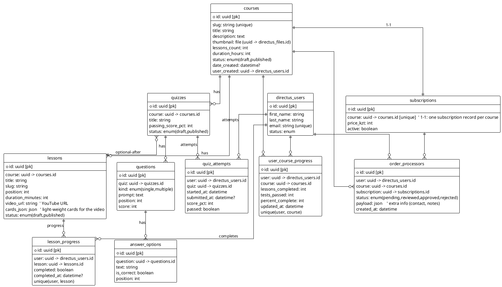

```plantuml
@startuml
!theme plain
hide circle
hide methods
skinparam linetype ortho

' Core system
entity "directus_users" as directus_users {
  + id: uuid [pk]
  --
  first_name: string
  last_name: string
  email: string (unique)
  status: enum
}

' Courses
entity "courses" as courses {
  + id: uuid [pk]
  --
  slug: string (unique)
  title: string
  description: text
  thumbnail: file (uuid -> directus_files.id)
  lessons_count: int
  duration_hours: int
  status: enum(draft,published)
  date_created: datetime?
  user_created: uuid -> directus_users.id
}

' Lessons (one course has many lessons)
entity "lessons" as lessons {
  + id: uuid [pk]
  --
  course: uuid -> courses.id
  title: string
  slug: string
  position: int
  duration_minutes: int
  video_url: string  ' YouTube URL
  cards_json: json   ' light-weight cards for the video
  status: enum(draft,published)
}

' Quizzes (can be per course, optionally attached to a lesson)
entity "quizzes" as quizzes {
  + id: uuid [pk]
  --
  course: uuid -> courses.id
  title: string
  passing_score_pct: int
  status: enum(draft,published)
}

entity "questions" as questions {
  + id: uuid [pk]
  --
  quiz: uuid -> quizzes.id
  kind: enum(single,multiple)
  prompt: text
  position: int
  score: int
}

entity "answer_options" as answer_options {
  + id: uuid [pk]
  --
  question: uuid -> questions.id
  text: string
  is_correct: boolean
  position: int
}

' Simple progress model
entity "lesson_progress" as lesson_progress {
  + id: uuid [pk]
  --
  user: uuid -> directus_users.id
  lesson: uuid -> lessons.id
  completed: boolean
  completed_at: datetime?
  unique(user, lesson)
}

entity "quiz_attempts" as quiz_attempts {
  + id: uuid [pk]
  --
  user: uuid -> directus_users.id
  quiz: uuid -> quizzes.id
  started_at: datetime
  submitted_at: datetime?
  score_pct: int
  passed: boolean
}

' Aggregated course progress (optional, denormalized for speed)
entity "user_course_progress" as user_course_progress {
  + id: uuid [pk]
  --
  user: uuid -> directus_users.id
  course: uuid -> courses.id
  lessons_completed: int
  tests_passed: int
  percent_complete: int
  updated_at: datetime
  unique(user, course)
}

' Subscriptions: one-to-one with Course (catalog entry)
entity "subscriptions" as subscriptions {
  + id: uuid [pk]
  --
  course: uuid -> courses.id [unique]  ' 1–1: one subscription record per course
  price_kzt: int
  active: boolean
}

' Very simple order processor requests (no payment storage, sends info to admin)
entity "order_processors" as order_processors {
  + id: uuid [pk]
  --
  user: uuid -> directus_users.id
  course: uuid -> courses.id
  subscription: uuid -> subscriptions.id
  status: enum(pending,reviewed,approved,rejected)
  payload: json    ' extra info (contact, notes)
  created_at: datetime
}

' Relationships
courses ||--o{ lessons : has
quizzes }o--|| lessons : optional-after
courses ||--o{ quizzes : has
quizzes ||--o{ questions : has
questions ||--o{ answer_options : has

directus_users ||--o{ lesson_progress : completes
lessons ||--o{ lesson_progress : progress

directus_users ||--o{ quiz_attempts : attempts
quizzes ||--o{ quiz_attempts : attempts

directus_users ||--o{ user_course_progress
courses ||--o{ user_course_progress

courses ||--|| subscriptions : 1–1
directus_users ||--o{ order_processors
courses ||--o{ order_processors
subscriptions ||--o{ order_processors
@enduml
```