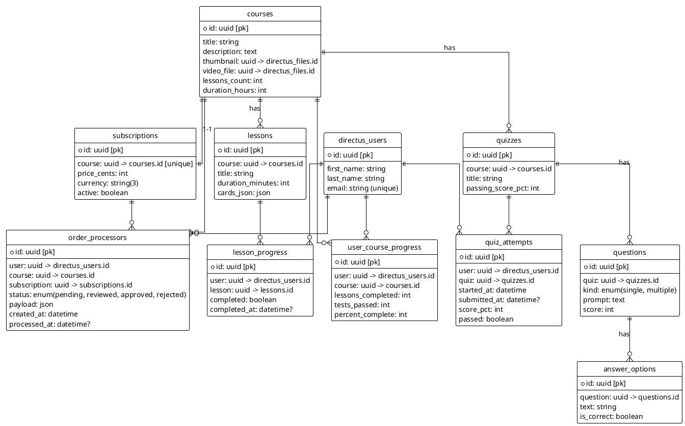

```plantuml
@startuml
!theme plain
hide circle
hide methods
skinparam linetype ortho

' NOTE: Directus system fields — `id`, `date_created`, `user_created`, `date_updated`, `user_updated`, `status`, and `sort` —
' are automatically managed by Directus and intentionally omitted from this ERD for clarity.

entity "directus_users" as directus_users {
  + id: uuid [pk]
  --
  first_name: string
  last_name: string
  email: string (unique)
}

entity "courses" as courses {
  + id: uuid [pk]
  --
  title: string
  description: text
  thumbnail: uuid -> directus_files.id
  video_file: uuid -> directus_files.id
  lessons_count: int
  duration_hours: int
}

entity "lessons" as lessons {
  + id: uuid [pk]
  --
  course: uuid -> courses.id
  title: string
  duration_minutes: int
  cards_json: json
}

entity "quizzes" as quizzes {
  + id: uuid [pk]
  --
  course: uuid -> courses.id
  title: string
  passing_score_pct: int
}

entity "questions" as questions {
  + id: uuid [pk]
  --
  quiz: uuid -> quizzes.id
  kind: enum(single, multiple)
  prompt: text
  score: int
}

entity "answer_options" as answer_options {
  + id: uuid [pk]
  --
  question: uuid -> questions.id
  text: string
  is_correct: boolean
}

entity "lesson_progress" as lesson_progress {
  + id: uuid [pk]
  --
  user: uuid -> directus_users.id
  lesson: uuid -> lessons.id
  completed: boolean
  completed_at: datetime?
  ' constraint: unique(user, lesson)
}

entity "quiz_attempts" as quiz_attempts {
  + id: uuid [pk]
  --
  user: uuid -> directus_users.id
  quiz: uuid -> quizzes.id
  started_at: datetime
  submitted_at: datetime?
  score_pct: int
  passed: boolean
}

entity "user_course_progress" as user_course_progress {
  + id: uuid [pk]
  --
  user: uuid -> directus_users.id
  course: uuid -> courses.id
  lessons_completed: int
  tests_passed: int
  percent_complete: int
  ' constraint: unique(user, course)
}

entity "subscriptions" as subscriptions {
  + id: uuid [pk]
  --
  course: uuid -> courses.id [unique]
  price_cents: int
  currency: string(3)
  active: boolean
}

entity "order_processors" as order_processors {
  + id: uuid [pk]
  --
  user: uuid -> directus_users.id
  course: uuid -> courses.id
  subscription: uuid -> subscriptions.id
  status: enum(pending, reviewed, approved, rejected)
  payload: json
  created_at: datetime
  processed_at: datetime?
}

' Relationships
courses ||--o{ lessons : has
courses ||--o{ quizzes : has
quizzes ||--o{ questions : has
questions ||--o{ answer_options : has

directus_users ||--o{ lesson_progress
lessons ||--o{ lesson_progress

directus_users ||--o{ quiz_attempts
quizzes ||--o{ quiz_attempts

directus_users ||--o{ user_course_progress
courses ||--o{ user_course_progress

courses ||--|| subscriptions : 1–1
subscriptions ||--o{ order_processors
directus_users ||--o{ order_processors
courses ||--o{ order_processors
@enduml
```