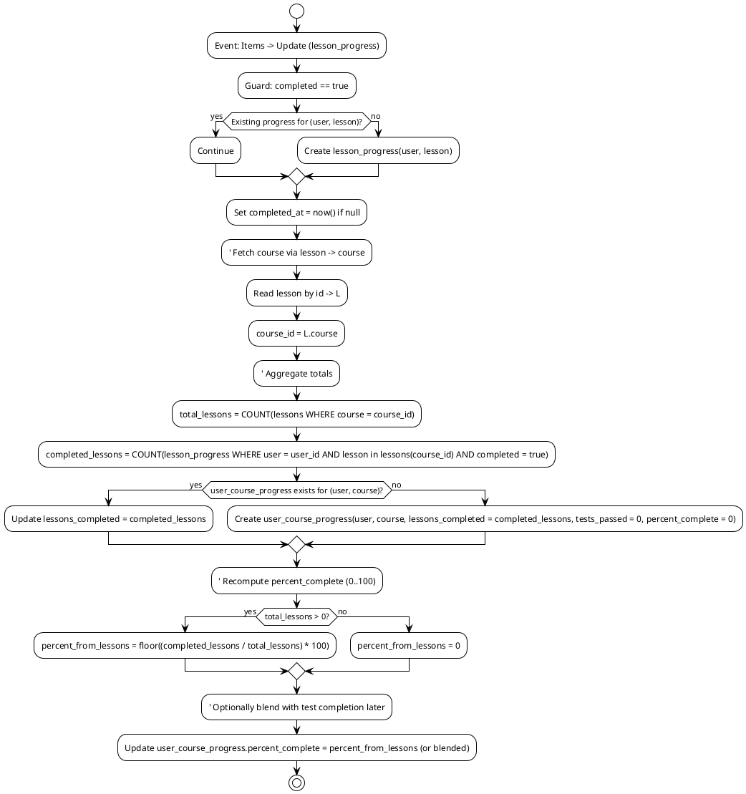
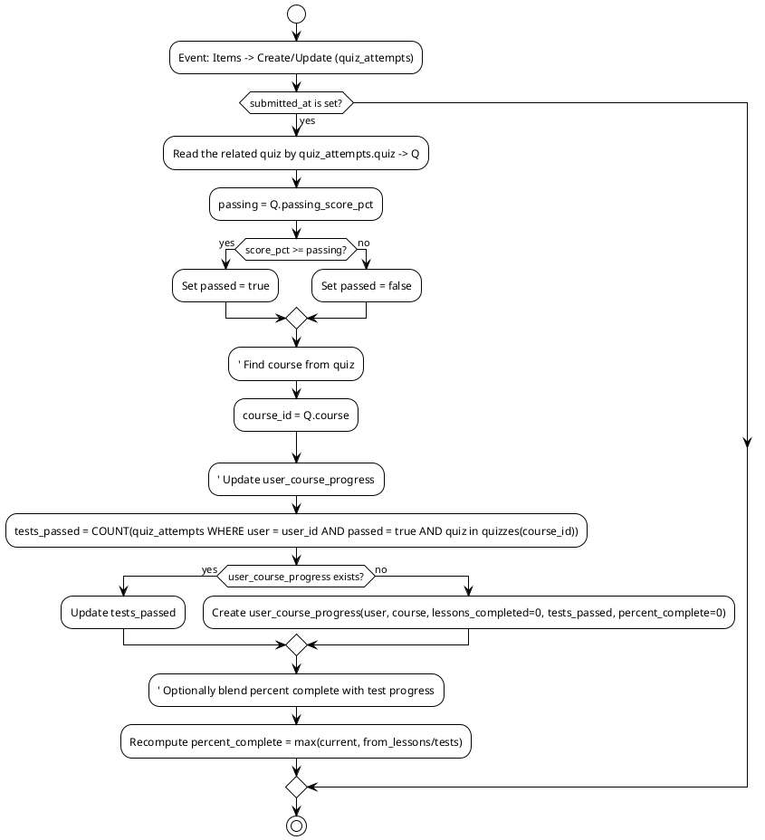
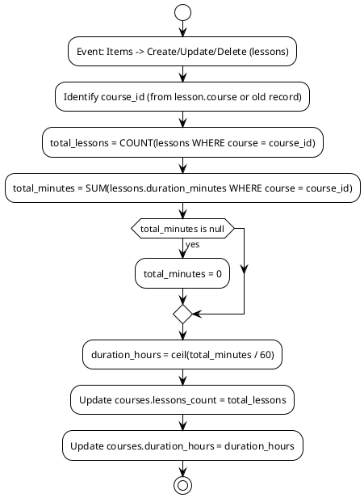
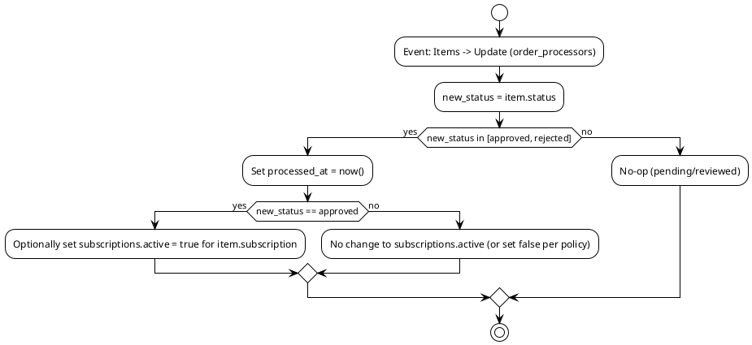
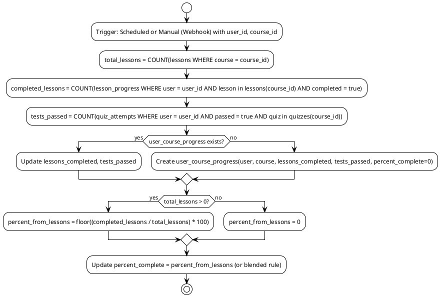

# Directus Flows (PlantUML)

This file diagrams the backend automation we’ll implement in Directus Flows. Each diagram includes a brief wiring guide (trigger + key operations) so you can configure it in Directus.

---

## 1) Lesson Completed → Update User Course Progress

Trigger when a user completes a lesson. Ensures unique lesson_progress, sets completed_at, and updates user_course_progress lessons_completed and percent_complete.

Wiring in Directus:

- Trigger: Event → Items → Update on collection `lesson_progress`
- Filter: `completed` changed to true
- Steps:
    - Read Item (lessons) by `lesson_progress.lesson`
    - Aggregate Count (lessons by course)
    - Aggregate Count (lesson_progress by user and in course)
    - Upsert Item (user_course_progress by unique (user, course))
    - Update Field (percent_complete)

---

## 2) Quiz Submitted → Compute Passed and Update Progress

On quiz_attempts submission, set passed based on score_pct vs quizzes.passing_score_pct, then update user_course_progress.tests_passed and percent_complete.

Wiring in Directus:

- Trigger: Event → Items → Create + Update on `quiz_attempts`
- Filter: `submitted_at` is not null
- Steps:
    - Read Item (quizzes) by `quiz_attempts.quiz`
    - Conditional: compare `score_pct` with `quizzes.passing_score_pct`
    - Update Field (`passed`)
    - Aggregate Count (passed attempts per user/course)
    - Upsert Item (user_course_progress)
    - Update Field (percent_complete)

---

## 3) Maintain Course Aggregates (lessons_count, duration_hours)

Keep course counters in sync whenever lessons are created/updated/deleted.

Wiring in Directus:

- Trigger: Event → Items → Create + Update + Delete on `lessons`
- Steps:
    - Resolve course_id (from payload or previous item on delete)
    - Aggregate Count (lessons by course)
    - Aggregate Sum (duration_minutes by course)
    - Update Item (courses)

---

## 4) Order Processing Status Transitions

Manage status transitions and timestamps on order_processors. On approved/rejected, stamp processed_at and, if needed, toggle subscription.active.

Wiring in Directus:

- Trigger: Event → Items → Update on `order_processors`
- Steps:
    - Condition on `status`
    - Update Field (processed_at)
    - Optional: Update Related Item (`subscriptions.active`)

---

## 5) Scheduled/Manual Backfill: Recalculate User Course Progress

Maintenance flow to recompute user_course_progress for a user/course pair, useful after bulk changes.

Wiring in Directus:
- Trigger: Schedule or Webhook
- Inputs: `user_id`, `course_id`
- Steps:
    - Aggregate Counts/Sums as above
    - Upsert user_course_progress
    - Update percent_complete

---

Notes
- All flows rely on the Directus default system fields; no extra custom audit fields are created.
- Percent complete currently uses lesson completion only. If you want to blend quizzes, define a formula, e.g., percent = round(0.8 * lessons + 0.2 * tests).
- Ensure unique constraints via Directus Composite Unique on (user, lesson) and (user, course) where applicable.

