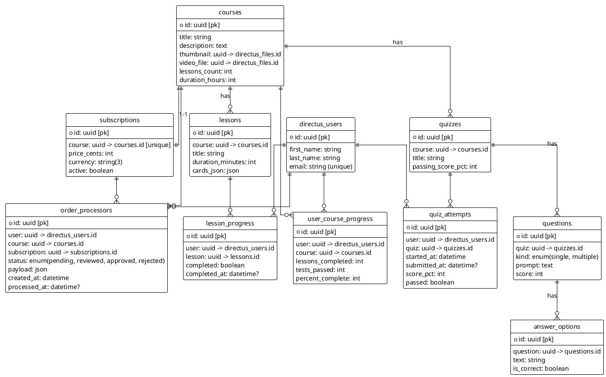

# SPEC-1-HappyWorld-ERD

## Background
HappyWorld is a simple tour-agency business course platform built with **Directus** as the backend CMS and API layer. The frontend is a separate client application that consumes the Directus REST/GraphQL API.

Users register through Directus (`directus_users`) and can purchase a **subscription**, which grants access to a specific course. Each course consists of lessons and quizzes. Lesson progress and quiz attempts determine user progress.

Order processing is intentionally simple: when a user submits a purchase intent, an `order_processors` record is created, and a Directus Flow sends a direct message (DM) to the administrator. Once the admin approves the order (`status = approved`), the user gains access to the associated course’s lessons and quizzes.

---

## Requirements (MoSCoW)

### Must
- Use `directus_users` for authentication (no separate profile collection).
- Collections: `courses`, `lessons`, `quizzes`, `questions`, `answer_options`, `lesson_progress`, `quiz_attempts`, `user_course_progress`, `subscriptions`, and `order_processors`.
- Each subscription represents **one specific course (1:1)**.
- A user can access lessons and quizzes **only when** there exists an `order_processors` record with `status = approved` for that user and course.
- Lessons have a `cards_json` field for inline interactive content.
- Courses reference a single uploaded `video_file` (Directus File) instead of an external video URL.

### Should
- Provide quick display fields: `lessons_count` and `duration_hours` on `courses`.
- Include `user_course_progress` as a denormalized table for faster dashboard reads.
- Use `status` and `sort` (Directus system fields) for all collections.

### Could
- Add `author` relation (M2O to `directus_users`) for content attribution.
- Add `published_at` field or use `status` for visibility.

### Won't
- Implement payment gateways (manual admin approval only).
- Add tagging or category systems for MVP.

---

## Method

### ERD (PlantUML)

?fields=id,title,lessons.id,lessons.title,lessons.position,quizess.id,quizess.title,quizess.position,lessons.lesson_progresses.completed,quizess.quiz_attempts.passed

---

## Implementation

### Collections Setup
- Create each collection (`courses`, `lessons`, `quizzes`, etc.) in Directus.
- Use UUID as the primary key for all tables.
- Add `sort` and `status` fields (Directus-managed) to support ordering and publication states.
- Define `m2o` relations according to the ERD.
- Add uniqueness constraints:
  - `subscriptions.course` (unique)
  - `lesson_progress (user, lesson)`
  - `user_course_progress (user, course)`

### Order Validation Logic
Access to lessons and quizzes must be restricted based on approved subscriptions.

Validation can be achieved through:
1. **Directus Field Validation Rules** – ensure proper payload shape and restrict duplicates.
2. **Directus Flows** – implement custom approval logic:
   - Trigger on create of `order_processors`.
   - Check for existing approved records for `(user, subscription)`.
   - If found, reject or mark duplicate.
   - Otherwise, set status to `pending` and send admin DM.
   - When admin sets status to `approved`, trigger follow-up Flow to grant user access (e.g., create progress record).

### Progress Tracking
- Use either dynamic (frontend-computed) or persisted (`user_course_progress`) calculation.
- Lessons completed + quizzes passed = progress percentage.

### Permissions
- **Public:** No access to courses or lessons (only authentication endpoints available).
- **Registered Users (Users role & Users access policy):**
  - Can view all published `courses` metadata.
  - Can create `order_processors` to request course subscription purchase.
  - Can view course `lessons` and `quizzes` **only if** they have an approved `order_processors` record (`status = approved`) for that course.
  - Can create and update their own `lesson_progress` and `quiz_attempts` records.
- **Admin:** Full read/write access to all collections, can approve/reject `order_processors` and manage Directus Flows.

---

## Milestones
1. Define core collections in Directus.
2. Implement Flows for `order_processors` and admin DM.
3. Add field validations and uniqueness rules.
4. Implement progress calculation logic.
5. Configure roles and permissions.

---

## Gathering Results
- Confirm user registration and authentication works.
- Verify order approval grants access to course content.
- Ensure Directus Flows and validations behave as intended.
- Test lesson and quiz progress tracking.

---
