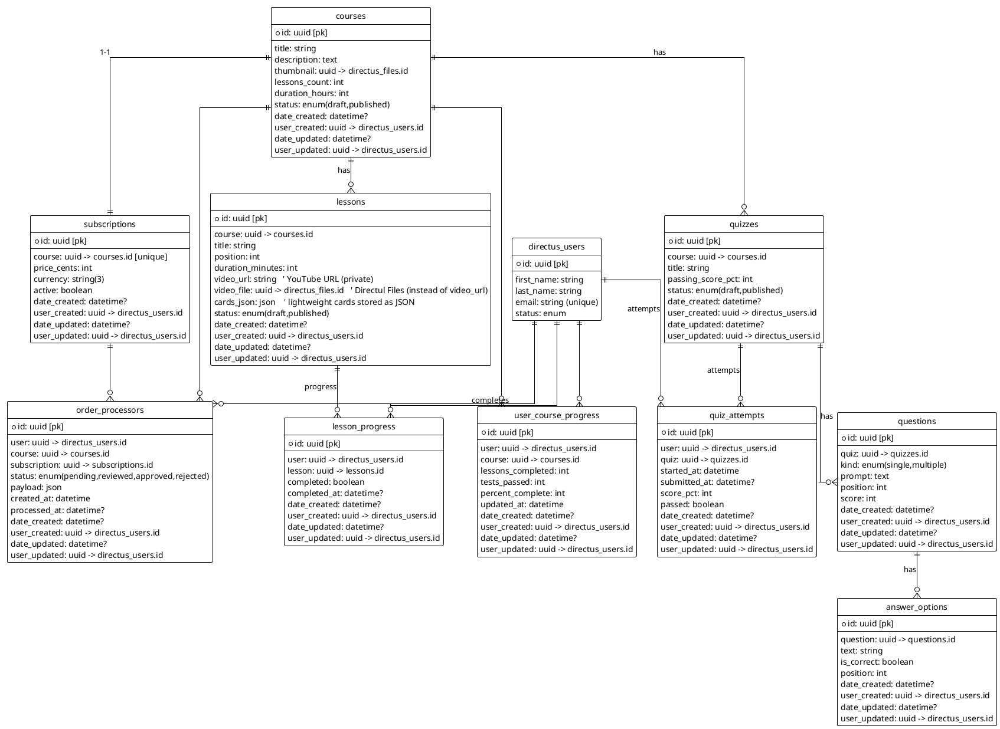

# SPEC-1-HappyWorld-ERD

## Background

HappyWorld is a simple tour-agency business course platform. The frontend is separated from backend: Directus will be the source-of-truth backend (collections + Directus API) and the frontend will consume the Directus REST/GraphQL API. The user registration uses `directus_users`. After registering, a user can buy a Subscription (each Subscription is attached 1:1 to a Course), then take a Course composed of Lessons (each Lesson has a single YouTube video URL and lightweight `cards_json` for in-video callouts). Quizzes (tests) are attached to Courses (course-level; many quizzes per course allowed). Progress (percent complete) is derived from lessons completed and quizzes passed. Order processing is intentionally simple: an `order_processors` record is created and a Directus Flow sends a DM to the Administrator — no complex payment gateway workflow required for MVP.

## Requirements (MoSCoW)

### Must
- Use `directus_users` for authentication and identity (no separate `profiles`).
- Collections: `courses`, `lessons`, `quizzes`, `questions`, `answer_options`, `lesson_progress`, `quiz_attempts`, `user_course_progress` (optional denormalized), `subscriptions` (1:1 with course), `order_processors`.
- Lessons must store a single `video_url` (YouTube private URL) and `cards_json` (json field) — no separate table for cards.
- Quizzes belong to Courses only (not lessons). Questions may be single or multiple choice. Answer options indicate which ones are correct.
- `order_processors` collects purchase intent and triggers a DM to admin via Directus Flow.
- Each collection must include Directus system fields: `id` (uuid, pk), `date_created`, `user_created`, `date_updated`, `user_updated`, plus standard properties (status, position where applicable).

### Should
- Provide `lessons_count` and `duration_hours` on `courses` (denormalized for quick UI display).
- Provide `user_course_progress` as an optional denormalized rollup to speed up reads.
- Enforce uniqueness where logical (e.g., unique(user, lesson) on `lesson_progress`).

### Could
- Add `author` (m2o -> `directus_users`) to `courses` for content attribution.
- Add `published_at` / use `status` enum to control visibility.

### Won't
- Create separate `profiles` collection — use `directus_users` only.
- Create category/tag systems for now.
- Implement full payment gateway flows — payment intent is manual via `order_processors` + admin DM.

## Method

Below is the PlantUML ERD to be used as the canonical design for Directus collections.

## Implementation (Directus-specific notes)

1. **Collections / Fields**
   - Create collections in Directus with the exact names above. When creating fields, use Directus data types (UUID PK, string, text, integer, boolean, json, datetime, file (m2o -> `directus_files`)).
   - Do **not** add custom `slug` fields. Let Directus manage system fields (`id`, `date_created`, `user_created`, `date_updated`, `user_updated`).

2. **Relations**
   - Use `m2o` relations for: lesson -> course, quiz -> course, question -> quiz, answer_option -> question, lesson_progress (user->lesson), quiz_attempts (user->quiz), subscriptions (course), order_processors (user/course/subscription).
   - Set unique constraint on `subscriptions.course` and on `lesson_progress(user, lesson)` and `user_course_progress(user, course)`.

3. **Flows and Automation**
   - `order_processors` creation should trigger a Directus Flow that sends a Direct Message to the Administrator and updates the `status` (pending -> reviewed/approved). Keep the Flow simple: no external payment calls for MVP.
   - When lesson completion or quiz attempt is recorded, optionally trigger a Flow to recalculate `user_course_progress` (if you choose to persist it). Alternatively, compute percent on read using Directus filters and a tiny frontend calculation.

4. **Permissions (roles)**
   - Public role: `read` only published `courses` metadata (no lessons, quizzes).
   - Authenticated user role: read published courses, list lessons only for enrolled (or after purchase) courses; create `lesson_progress` and `quiz_attempts`; create `order_processors` (to buy subscription).
   - Admin role: full read/write on all collections and access to Flows.

5. **Progress calculation**
   - Option A (compute on read): frontend queries count of lessons for course + count of `lesson_progress` (completed) + quizzes passed from `quiz_attempts` to compute percent.
   - Option B (persist rollup): Flow or hook updates `user_course_progress` after each lesson completion / quiz attempt. This improves read performance for dashboards.

6. **Quiz grading**
   - Keep answer options with `is_correct` flags. When a `quiz_attempt` is submitted the backend (Directus Flow or external function) grades the attempt by comparing submitted answers to `answer_options` and sets `score_pct` and `passed`.

## Milestones (MVP roadmap)

1. Create core collections: `courses`, `lessons`, `quizzes`, `questions`, `answer_options`, `subscriptions`, `order_processors`.
2. Create `lesson_progress` and `quiz_attempts` collections + unique constraints.
3. Implement Directus Flow for `order_processors` -> admin DM.
4. Implement quiz grading Flow (grades `quiz_attempts`).
5. Decide and implement `user_course_progress` approach (compute-on-read vs persisted).
6. Setup roles & permissions for public/auth/admin.

## Gathering Results / Validation

- Validate that: 1) Users can register and authenticate via Directus; 2) Users can create `order_processors` records to request subscription purchase; 3) Admin receives DM on new `order_processors`; 4) After subscription is approved, users can access lessons and take quizzes; 5) `lesson_progress` and `quiz_attempts` store proper timestamps and scores; 6) Progress percentage shown in frontend matches computed values.

---

**Questions (pick one or both so I can iterate):**
1. Do you want `user_course_progress` to be **persisted** (updated by a Flow on each event) or **computed on read** by the frontend? I recommend **computed on read** for MVP simplicity; **persisted** for faster dashboards.
2. Default currency for `subscriptions.price_cents` — use **USD** or another currency?

